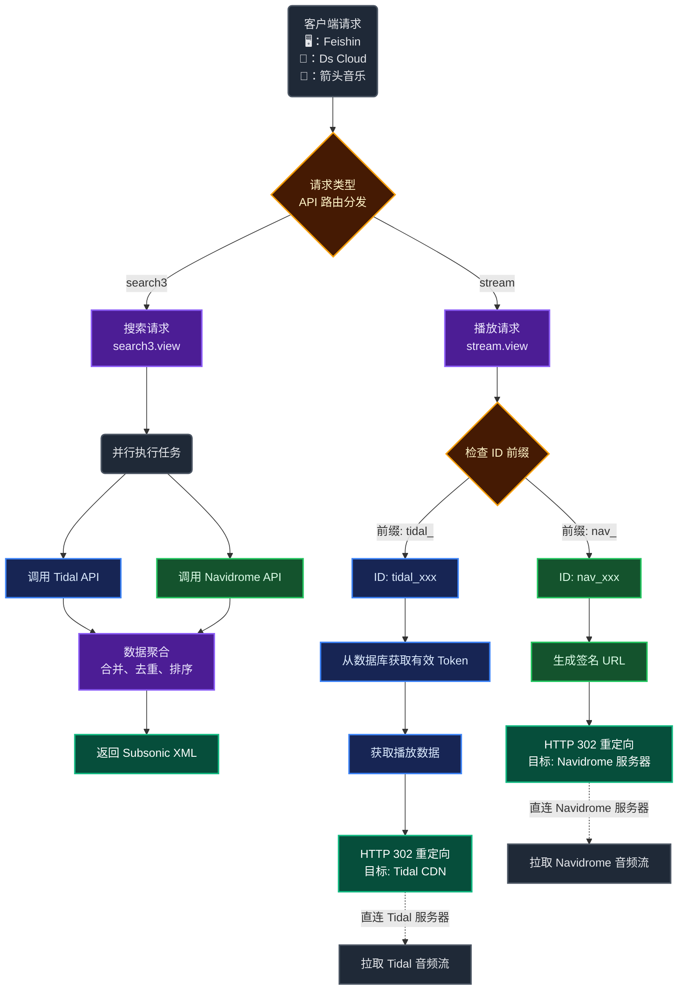

# 🚀 Tidal-Navidrome-Bridge
Tidal-Navidrome-Bridge 是一个基于 FastAPI 和 Asyncio 构建的中间件。它通过劫持并重写 Subsonic API 协议，将 Navidrome 与 Tidal 无缝聚合为一个统一的音乐服务节点，并实现了基于前缀 (nav_ 或 tidal_) 的智能路由分发系统。

-------------------------------------------------------------------------------------------
## ✨ 核心
1. ⚡ 异步高并发与智能路由 (Async IO & Smart Routing)
混合数据源聚合: 利用 asyncio.gather 并行请求 Navidrome API 和 Tidal API。搜索请求 (search3) 会同时分发给两端，并在内存中进行去重和排序合并。
ID 前缀命名空间:
本地资源: 自动识别并注入 nav_ 前缀，请求透明转发至 Navidrome 后端。
在线资源: 识别 tidal_ 前缀，直接调用 Tidal API 获取元数据。
连接池管理: 使用 httpx.AsyncClient 配合 Limits(max_keepalive_connections=20) 进行连接复用，并使用 asyncio.Semaphore 限制 Tidal 并发请求数，防止触发 429 Rate Limit。

2. 🛡️ 独立的 Token 守护进程
进程隔离: 主服务 (main.py) 启动时，会自动生成一个子进程运行 login.py --daemon。
自动保活: 守护进程每 30 分钟轮询 SQLite 数据库 (app.db)，检查 tidal_expiry_time。一旦发现 Token 即将过期（< 1小时），自动调用 Refresh Token 接口刷新，并将新 Token 写回数据库，确保主服务读取到的永远是有效凭证。
WebSocket 交互式登录: 前端 (index.html) 通过 WebSocket 连接 /ws/run-login，实时流式传输 login.py 的标准输出 (stdout)，实现了在 Web 页面上完成命令行式的 Device Flow 授权。

3. 🔐 自定义鉴权与配置体系
双层鉴权:
App 层: 兼容 Subsonic 的 u (username), t (token), s (salt) 签名验证。
Admin 层: 基于 python-jose 的 JWT 鉴权，用于保护 Web 管理面板。
文本化配置数据库: 支持特殊的 config.txt 格式，采用 ------------- 分隔符：
上半部分: username:password 键值对。
下半部分: 允许注册的 邀请码 (Invite Codes) 列表。
代码特性: 每次登录或注册时，自动同步文件配置至 SQLite 数据库。

4. 🎵 增强的媒体处理
歌词代理: getLyrics 接口被重写，即使是 Navidrome 的歌曲，也能尝试通过元数据匹配从 Tidal 获取同步歌词。
无损流媒体: 拦截 stream 接口，针对 Tidal 资源请求 playbackinfopostpaywall，解析 LossLess的 FLAC 直链并返回 302 Redirect，大幅降低中间件带宽消耗。
封面图即时代理: 实现了 getCoverArt 路由，支持从 Tidal CDN 获取不同尺寸 (320x320, 1280x1280) 的封面(自行修改)，或回源至 Navidrome。
其中专辑名和歌手名前面带 (T) 的为Tidal资源。

6. 🖥️ 📱 客户端推荐
-------------------------------------------------------------------------------------------
* 🖥️ 电脑端：
* 飞信 https://github.com/jeffvli/feishin
-------------------------------------------------------------------------------------------
* 📱 手机端：
* Ds Cloud: https://apps.apple.com/cn/app/ds-cloud-%E9%AB%98%E6%B8%85%E5%BD%B1%E7%89%87-%E6%97%A0%E6%8D%9F%E9%9F%B3%E4%B9%90%E8%BD%BB%E6%9D%BE%E6%92%AD%E6%94%BE/id6476057278
-------------------------------------------------------------------------------------------
* 箭头音乐: https://www.amcfy.com
-------------------------------------------------------------------------------------------
## 🛠️ 环境要求
* Python 3.10+

## 🚀 部署说明
#### 安装依赖
```text
pip install -r requirements.txt --break-system-packages
```

### ✨ 配置文件 (config.txt)
* 在根目录创建 config.txt，格式必须严格遵守以下规范
* 初始账号密码与邀请码：
```text
admin:admin
-------------
huduiwqey37674632
```

### 🚀 启动进程
```text
python3 main.py
```

###  🖥️ 📱 客户端接入：
* 电脑端：Feishin / 手机端：Ds Cloud 或 箭头音乐 中填入：
* 服务器: http://<IP>:8000 或 https://<IP>:8000
* 账号密码为登录管理页面的账号密码
-------------------------------------------------------------------------------------------
  
  
-------------------------------------------------------------------------------------------
  


